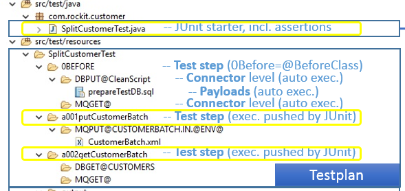
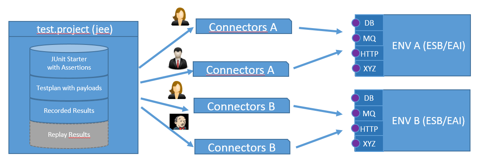

<!--[](http://www.rockit.consulting) -->
<p align="right"></p>

# test.rockitizer - Keep Your Integration Tested!

<br>
<!--Easy-to-use junit based framework for the testing of complex integration scenarios. Using the declarative test plans and automated comparison between current test-snapshots and recorded master-results, it keeps you informed on any suspicious change of system behavior.-->

## <a name="bigideabehind"></a> Big Idea Behind 

The modern IT landscape is increasing in integration complexity due to various communication protocols and data formats.  

**test.rockITizer** addresses this problem, introducing an API Testing framework with built in record/replay/assert functionality. 

The main idea for test.rockITizer has been taken from the industry, where the master samples get compared with the produced samples, thus assuring the desired quality

This approach assumes the following major phases: 

1. Recording: definition of the inputs and sample master results  

2. Definition of quality profiles/assertions

3. Regression/Replay Mode: automated comparison between current test-snapshots and recorded master-results.

This way the integration landscape of any complexity is treated as a blackbox, keeping you informed of any suspicious change in the system behavior.


[Lifecycle test.rockitizer](http://www.rockit.consulting/images/github/test_rockitizer_lifecycle.PNG "Lifecycle test.rockitizer;IBM Integration Bus; Integration testing; Test framework;test.rockitizer")

Furthermore, the framework enables the "test first" approach, thus developing against pre-defined "target" interface until the replay snapshot matches.

Test.RockITizer covers with its connectors the majority of protocols in integration area, making obsolete the usage of external tools like soap-ui, db explorer, mq explorer, etc., thus improving productivity of overall development process.

*Originally developed for ESB, especially for IBM Message Broker/IBM Integration Bus (used in examples), but can be used for any integration platform.* 

<!--## <a name="corefeatures"></a> Core Features:
  - environment dependent configuration for connectors and payloads (once written runs everywhere: Local/DEV/INT)
  - declarative `test-plan` concept, [see details](#declarativetestplan)
  - separation of `test-plan` and `connector configuration` concept, [see details](#testdataseparation)
  - extendable connector/plugin architecture
  - `Record`/`Replay with post Assertion` Modes
  - `MQGET`/`MQPUT`, `DBGET`/`DBPUT`, `FILEGET`/`FILEPUT`/`FILEDEL`, `SCPPUT`/`SCPGET` connectors available
  - `HTTP` - `GET` / `PUT` / `POST` / `DELETE` connectors available and enabled for HTTPS, SOAP, REST, including support for PKI, BasicAuth, WS-Security, etc.
  - `DB`, `File`, `CSV`, `XMLUnit` assertion plugins available, enabling full control by comparing the different types of master-/test-payloads
  - regression testing and continuous integration enabled, including surefire reports -->

<br>

## <a name="corefeatures"></a> Core Features:

Regression testing and continuous integration enabled, including surefire reports

* Powerful CLI interface

* Binding over single jar dependency from maven central

* `Record`/`Replay` with post `Assertion` Modes

* Numerous connectors available: `HTTP, MQGET/MQPUT, DBGET/DBPUT, FILEGET/FILEPUT/FILEDEL, SCPPUT/SCPGET`

* Various assertions which enable deep comparison for different types of payloads: `XML, CSV`, etc. and Resources, e.g. DB

* Environment-dependent configuration for connectors and payloads (once written runs everywhere: `Local`/`Jenkins`/`INT`)

* Declarative test-plan concept

* Extendable connector/plugin architecture

* Support for multiple DB-DataSources, KeyStores, Queue-Managers

<br>

## <a name="uniqueadvantages"></a> Unique Advantages
* Improved productivity for developers. No additional tools like SOAP-UI, DB-Viewers, MQ-Tools needed.
* Test-Driven Development for Integration landscapes, via developing against desired targets.

<br>

## <a name="cli"></a> CLI

Format: 

<br>

## <a name="runningtests"></a> Running Tests

### <a name="console"></a> Console

```
__________               __   .__  __  .__                      
\______   \ ____   ____ |  | _|__|/  |_|__|_______ ___________  
 |       _//  _ \_/ ___\|  |/ /  \   __\  \___   // __ \_  __ \ 
 |    |   (  <_> )  \___|    <|  ||  | |  |/    /\  ___/|  | \/ 
 |____|_  /\____/ \___  >__|_ \__||__| |__/_____ \\___  >__|    
        \/            \/     \/                 \/    \/        

 INFO #############################################################################
 INFO # 		 <JSONwithDatabaseTest>: Configuration
 INFO #############################################################################
 INFO TESTNAME: JSONwithDatabaseTest
 INFO RECORD FOLDER: C:/rockit/projects/github/test.rockitizer.demo/demo.rockitizer/src/test/resources/JSONwithDatabaseTest/
 INFO REPLAY FOLDER: C:/rockit/projects/github/test.rockitizer.demo/demo.rockitizer/target/replay/JSONwithDatabaseTest/
 INFO MODE: REPLAY
 INFO #############################################################################
 INFO # 		 <JSONwithDatabaseTest>: Executing  [REPLAY]
 INFO #############################################################################
 INFO 
 INFO *****************************************************************************
 INFO 0BEFORE	 Step Added. Executing... 
 INFO 0BEFORE	 [Connector:DBPUT.CLAEN] - Writing ...
 INFO 0BEFORE	 [Connector:MQGET.ERROR] - Reading ...
 INFO 0BEFORE	 Deleting replay  folder C:/rockit/projects/github/test.rockitizer.demo/demo.rockitizer/target/replay/JSONwithDatabaseTest/
 INFO 
 INFO *****************************************************************************
 INFO a001JSONPutMessage	 Step Added. Executing... 
 INFO a001JSONPutMessage	 [Connector:HTTP.JADDBOOK] - Writing ...
 INFO a001JSONPutMessage	 [Connector:HTTP.JADDBOOK] - Reading ...
 INFO 
 INFO *****************************************************************************
 INFO a002DBGETMessage	 Step Added. Executing... 
 INFO a002DBGETMessage	 [Connector:DBGET.GETBOOKS] - Reading ...
 INFO #############################################################################
 INFO # 		 <JSONwithDatabaseTest>: Assertion
 INFO #############################################################################
 INFO  Number of assertions processed successfully: 4 [
	XMLFileAssertion( path:"\a001JSONPutMessage", ignoreFields:"CF-RAY,ETag,Access-Control-Allow-Origin,Connection,Set-Cookie,Date,Expect-CT,X-Powered-By,createdAt,id,ID" ),
	XMLFileAssertion( path:"\a002DBGETMessage" ),
	FileAssertion("\"),
	FileAssertion("\")
      ]

Time: 1,36

OK (1 test)

Result: OK
Total runs 1


test.rockizer Copyright (C) 2020 rockit.consutling GmbH 
This program is distributed under GPL v3.0 License and comes with ABSOLUTELY NO WARRANTY 
This is free software, and you are welcome to redistribute it under GPL v3.0 conditions 
```

<br>

## <a name="ide"></a> IDE

Format: 

<br>

## <a name="jenkins"></a> Jenkins
For a complete understanding including junit starter and project layout, please refer to QuickStart Guide.

<br>

## <a name="mainconcepts"></a> Main Concepts
According to the maven conventions the following folders of  your test.project are important:
- `src/test/resources/` - location of the test plans
- `src/test/java/` - location of the junit test runner

Junit serves as glue and looks for the test plan with the same name starting its execution from the root folder.
Dependent on mode record/replay it keeps the test outputs in xml format and starts the preconfigured assertions between the recorded and replayed payloads, writing the test protocol [to the console](#reportsample).

### <a name="declarativetestplan"></a> Concept of Declarative Test Plan

 
 	
1. The test plans are folders stored under `src/test/resources/` and must have the same arbitrary name as the corresponding junit starter, i.e. `SplitCustomerTest`.
2. Each **test plan** has one or more test steps (subfolders) with arbitrary names, i.e. `a001putCustomerBatch`,`a002getCustomerBatch`.  Junit starter adds a step to execution.  
3. Each **test step** has multiple subfolders (connectors), with the strict naming convention `<ConnectorType>.<ID>`. The `ID` will be looked up in configuration, i.e. `DBGET.CUSTOMERS`,`MQPUT.CUSTOMERBATCH` 
4. All **connectors** processed automatically based on `<ConnectorType>`: PUT/GET i.e.: 
    - MQGET. - reads all messages in Queue with `<ID>`
    - MQPUT. - submits the payloads from connector folder into Queue with `<ID>` 

For the test plan reference check [docu](docs/USAGE.md#testplan)

**The declarative test-plan approach reduces the maintanence costs of the test-suite**.  


### <a name="testdataseparation"></a> Test Data Separation from Environment Configuration

 

The following parts of the test.project are supposed to be environment independent:
- junit starter with assertions
- test-plan with payloads 
- recorded test output (master record)


They should be committed in the source repository and will be shared across users and environments. **Write test once and start it anywhere**.  

* replay output is also environment neutral but generated during the test execution, thus not checked in.

<br>

## Getting started


[Quick-Start Guide](https://rockit.atlassian.net/wiki/spaces/TR/pages/941228053/Quick+Start)

<br>

##  <a name="reportsample"></a> Report Sample

```
 INFO #############################################################################
 INFO # 		 <SplitCustomerTestOK>: Configuration
 INFO #############################################################################
 INFO TESTNAME: SplitCustomerTestOK
 INFO RECORD FOLDER: C:/rockit/github/test.rockitizer/examples/splitcustomer.rockitizer/src/test/resources/SplitCustomerTestOK/
 INFO REPLAY FOLDER: C:/rockit/github/test.rockitizer/examples/splitcustomer.rockitizer/target/replay/SplitCustomerTestOK/
 INFO MODE: replay
 INFO #############################################################################
 INFO # 		 <SplitCustomerTestOK>: Executing  [replay]
 INFO #############################################################################
 INFO 0BEFORE	 Copying /src/test/resources/0BEFORE to /target/replay/0BEFORE
 INFO 
 INFO *****************************************************************************
 INFO 0BEFORE	 Step Added. Executing... 
 INFO Connecting MQQueueManager IB9QMGR
 INFO 0BEFORE	 Deleting replay  folder C:/rockit/github/test.rockitizer/examples/splitcustomer.rockitizer/src/test/resources/SplitCustomerTestOK/output
 INFO a001putCustomerBatch	 Copying /src/test/resources/a001putCustomerBatch to /target/replay/a001putCustomerBatch
 INFO 
 INFO *****************************************************************************
 INFO a001putCustomerBatch	 Step Added. Executing... 
 INFO a001putCustomerBatch	 [Connector:MQPUT.SPLITCUSTOMER.BATCH.IN] - Writing ...
 INFO Message successfully written to SPLITCUSTOMER.BATCH.IN                          
 INFO a002getCustomerBatch	 Copying /src/test/resources/a002getCustomerBatch to /target/replay/a002getCustomerBatch
 INFO 
 INFO *****************************************************************************
 INFO a002getCustomerBatch	 Step Added. Executing... 
 INFO  Waiting 1000ms for results
 INFO MQConnectorOut [SPLITCUSTOMER.CUSTOMER.OUT] get  message size 186
 INFO a002getCustomerBatch	 [Connector:MQGET.SPLITCUSTOMER.CUSTOMER.OUT] - Reading ...
 INFO MQConnectorOut [SPLITCUSTOMER.CUSTOMER.OUT] get  message size 213
 INFO a002getCustomerBatch	 [Connector:MQGET.SPLITCUSTOMER.CUSTOMER.OUT] - Reading ...
 INFO MQConnectorOut [SPLITCUSTOMER.CUSTOMER.OUT] get  message size 188
 INFO a002getCustomerBatch	 [Connector:MQGET.SPLITCUSTOMER.CUSTOMER.OUT] - Reading ...
 INFO MQConnectorOut [SPLITCUSTOMER.CUSTOMER.OUT] get  message size 247
 INFO a002getCustomerBatch	 [Connector:MQGET.SPLITCUSTOMER.CUSTOMER.OUT] - Reading ...
 INFO #############################################################################
 INFO # 		 <SplitCustomerTestOK>: Assertion
 INFO #############################################################################
 INFO  Number of assertions processed successfully: 3 [
	com.rockit.common.blackboxtester.assertions.XMLFileAssertion@ae9b55,
	com.rockit.common.blackboxtester.assertions.FileAssertion@1700915,
	com.rockit.common.blackboxtester.assertions.FileAssertion@1de60b4
      ]
```

<br>

## <a name="authors"></a> Authors

`test.rockitizer` was created by [`Yefym Dmukh`](https://github.com/yefymdmukh).


`test.rockitizer` is sponsored by [`rockit.consulting GmbH`](http://www.rockit.consulting/)

<br>

## <a name="license"></a> License
GNU General Public License v3.0 or later

See [LICENSE](LICENSE.md) to see the full text.

<br>

## <a name="publications"></a> Publications
[IBM Integration Community: junit based integration testing](https://developer.ibm.com/integration/blog/2017/08/29/junit-based-integration-testing-ibm-integration-bus/).
