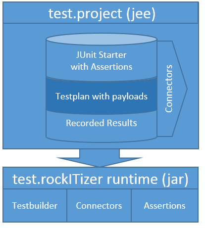

[Back to Main](../README.md)

## Build test.rockitizer
In order to build the runtime please execute the following steps: 
1. Import the project as maven project using your ide
2. Provide the non-free dependencies upon your connector needs, i.e. mq libs, oracle client, db2, etc. 
3. Run maven build

