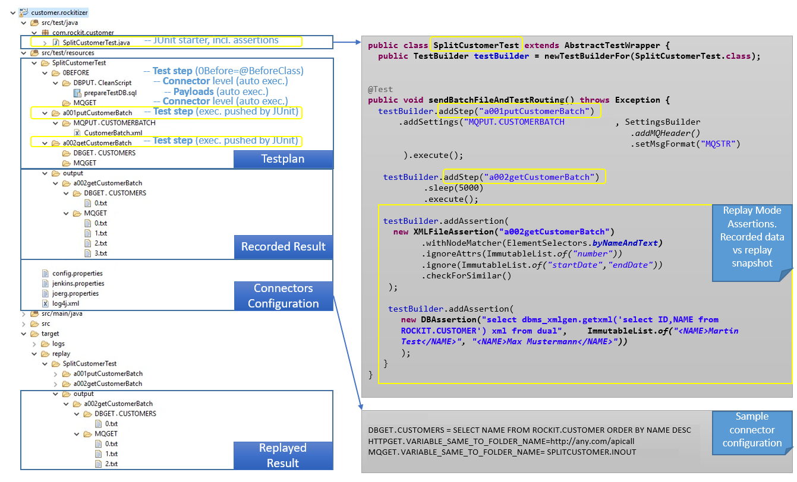

# <a name="basicexecutionflow"></a> Basic execution flow

														

According to the maven conventions the following folders are important:
- `src/test/resources/` - location of the **test plans**
- `src/test/java/` - location of the junit **test runner**


## Test plan

- Located under: `src/test/resources/<testname>`
- Test plan has custom folders which are step containers, e.g.:     
  
	- <testname>\01addTrigger  
	- <testname>\02readResults 

- Each step contains folders which serve as connectors and have following naming convention:
 
	- <CONNECTOR>.<CONFIGURATION_ALIAS>  
		- CONNECTOR - MQPUT, DBGET, etc. See supported connectors for the whole list
		- CONFIGURATION_ALIAS - binding between folder and environment dependent value (configuration system), e.g. Queue Name, SQL Select, etc. 


Sample connector: 
	- <testname>\<stepname>\DBGET.SELECTCUSTOMER  
	- <testname>\<stepname>\DBPUT.MYDATABASE
	 

## Test runner

- Located under: `src/test/java/<package>/<testname>Test.java`
- `<testname>Test` shall have the same name to the test plan folder
  
 Sample connector:
 - SplitCustomertTest.java

## Execution flow 

Junit serves as glue and looks for the test plan with the same name starting its the execution from the root folder and has following steps:
1. each step of the test is the folder which is executed via `testBuilder.addStep("foldername").execute()` command. During execution all connectors within the folder are processed automatically according to the connector type PUT/GET.
2. The results, if any, are kept in the `output` within the step and corresponding connector folder.  
3. The `record` mode puts the output data inside `src/test/resources/<testname>/output/<teststep>/<connector>`, the `replay` stores the temporary data within the `target/replay/<testname>/output/<teststep>/<connector>`
4. Within the last step of `replay` mode the configured assertions `testBuilder.addAssertion(<AssertionImpl>(<fodername>)` being processed.

## Sample project layout


For the fast and easy start with the `test.project` use the provided [example](../examples/README.md)


# <a name="configuration"></a> Test project configuration
The following configuration files are available for your test project: 
1. `config.properties` - all other connectors and MQ Configuration
2. `env_xyz.properties` - optional maven profile to support multiple environments 
3. `pom.xml` - maven project file maintains the profiles like `env_xyz.properties`

According to placeholders pattern the `config.properties` are allowed to store the placeholders `${propertyName}` which will be replaced with the value of the same key in `env_xyz.properties`.

Basically it allows to make all connector settings in main files environment independent, providing the exact values using maven profiles. 

## Configurable payloads

All Put connectors submiting the payloads may have the placeholders within. Please use the standard markup `${PLACEHOLDER}` and the corresponing entry in the `config.properties`: `PLACEHOLDER=Value`. 

### Supported connectors

	- FILEPUT
	- FILEDEL
	- FILEGET
	- MQPUT
	- MQGET
	- DBPUT
	- DBGET
	- SCPPUT


## Connectors

###Important!!!

Common property:

	1. Name of the connector folder has the following naming convention <CONNECTOR>.<YOUR_KEY>
	2. Configuration looks up for the value of <CONNECTOR>.<YOUR_KEY> to execute
	3. Complex connectors like MQ,DB, SCP are using the underlying connection factories
		3.1. Connector specific factory follows the naming convention: 
					<CONNECTOR>.<YOUR_KEY>.<FACTORY_NAME>.<FACTORY_PROPERTY>=
					e.g.
					DBGET.DRIVER= SELECT * FROM DRIVER
					DBGET.DRIVER.DATASOURCE.USERNAME=${SECONDARY.DATASOURCE.USERNAME}	
					DBGET.DRIVER.DATASOURCE.PASSWORD=${SECONDARY.DATASOURCE.PASSWORD}
					DBGET.DRIVER.DATASOURCE.URL=${SECONDARY.DATASOURCE.URL}
					
      		3.2 if not declared the fall back to generic factory takes place:	
      					<FACTORY_NAME>.<FACTORY_PROPERTY>=				
					e.g.
					MQMANAGER.NAME=${MQMANAGER.NAME}
					MQMANAGER.PORT=${MQMANAGER.PORT}
					MQMANAGER.HOST=${MQMANAGER.HOST}
					MQMANAGER.CHANNEL=${MQMANAGER.CHANNEL}
					MQMANAGER.USR=${MQMANAGER.USR}
					MQMANAGER.PWD=${MQMANAGER.PWD}

					or
					
					DATASOURCE.USERNAME=${DATASOURCE.USERNAME}	
					DATASOURCE.PASSWORD=${DATASOURCE.PASSWORD}
					DATASOURCE.URL=${DATASOURCE.URL}
					

Common properties of GET connectors: 
	
	Uses configuration to setup the connection, based on the folder name. Reads payloads and writes the 
	output to the testcase/teststep/output/connector.
	
Common properties of PUT connectors:
	
	Writes payload(s) from the testcase/teststep/connector folder using the specified connector configuration. 
	Payload could contain the placeholders which are interpolated during the test execution. Payload placeholder 
	value is over the common configuration to configure: config.properties. Case of environment dependent configu-
	ration please use the specific profiles, e.g. local.properties
	
	e.g. Payload sql with environment dependent schema: 
		DBSCHEMA=${DBSCHEMA}
	 

### MQGet
Description: reads all messages from queue as xmls. 

Testplan folder: 
        
	MQGET.<TESTSTEP.FOLDER>
	MQPUT.<TESTSTEP.FOLDER>
	e.g. folder: MQGET.CUSTOMER_QUEUE 
	
	
config.properties:
        
	MQMANAGER.NAME=QMGR
	MQMANAGER.PORT=1414
	MQMANAGER.HOST=localhost
	MQMANAGER.CHANNEL=SYSTEM.BKR.CONFIG
	MQMANAGER.USR=admin
	MQMANAGER.PWD=admin
	
	MQGET.<TESTSTEP.FOLDER>=SPLITCUSTOMER.CUSTOMER.OUT
	


### MQPut
Description: puts all messages from connector folder into queue 

Testplan folder: 
        
	MQPUT.<TESTSTEP.FOLDER>
	MQGET.<TESTSTEP.FOLDER>
config.properties:
        
	MQMANAGER.NAME=<IB9QMGR>
	MQMANAGER.PORT=<1414>
	MQMANAGER.HOST=<localhost>
	MQMANAGER.CHANNEL=<SYSTEM.BKR.CONFIG>
	
	MQGET.<TESTSTEP.FOLDER>=SPLITCUSTOMER.CUSTOMER.OUT
	MQPUT.<TESTSTEP.FOLDER>=SPLITCUSTOMER.CUSTOMER.IN

### HTTPGet
Description: gets http/https response as xml

Testplan:
       
	 HTTPGET.<TESTSTEP.FOLDER>
	 e.g. HTTPGET.MYHTTPCONNECTOR	 
config.properties:         

    HTTPGET.<TESTSTEP.FOLDER>=http://google.com/get
	  


### SCPPut
Description: writes the connector payload to configured destination

Testplan folder: 
        
	SCPPUT.<TESTSTEP.FOLDER>
config.properties:
	
	SCPPUT.<TESTSTEP.FOLDER>.HOST=
	SCPPUT.<TESTSTEP.FOLDER>.USR=
	SCPPUT.<TESTSTEP.FOLDER>.PWD=
	SCPPUT.<TESTSTEP.FOLDER>.PATH=

### DBGet
Description: executes the configured SQL and stores it as xml 

Testplan folder: 
        
	DBGET.<TESTSTEP.FOLDER>
config.properties:
        
	DBGET.<TESTSTEP.FOLDER> = SELECT * FROM TABLE ORDER BY ID 
		or
	DBGET.<TESTSTEP.FOLDER> = SELECT ID\\,NAME\\,SURNAME FROM TABLE ORDER BY ID
	
	
	DATASOURCE.USERNAME=${DATASOURCE.USERNAME}	
	DATASOURCE.PASSWORD=${DATASOURCE.PASSWORD}
	DATASOURCE.URL=${DATASOURCE.URL}


### DBPut

Description: executes the connector payloads against configured db

Testplan folder: 
        
	DBPUT.<TESTSTEP.FOLDER>
config.properties:
        
	DATASOURCE.USERNAME=${DATASOURCE.USERNAME}	
	DATASOURCE.PASSWORD=${DATASOURCE.PASSWORD}
	DATASOURCE.URL=${DATASOURCE.URL}
	
	
### FILEPut

Description: writes files from test folder to the specified location. Used to integrate file connectors.

Testplan folder: 
        
	FILEPUT.<TESTSTEP.FOLDER> 
config.properties:
	
	FILEPUT.<TESTSTEP.FOLDER>.PATH=C:\\temp\\test.rockitizer\\FileConnectorUsage


### FILEGET

Description: takes specific file and copies it to the output folder. Used to integrate file connectors.

Testplan folder: 
        
	FILEGET.<TESTSTEP.FOLDER> 
config.properties:
	
	FILEGET.<TESTSTEP.FOLDER>.PATH=C:\\temp\\test.rockitizer\\FileConnectorUsage	


### FILEDEL

Description: Cleans the target folder, used for 0BEFORE preclean before testing the file connectors.

Testplan folder: 
	
	FILEDEL.<TESTSTEP.FOLDER> 
config.properties:
	
	FILEDEL.<TESTSTEP.FOLDER>.PATH=C:\\temp\\test.rockitizer\\FileConnectorUsage


### <a name="testprojectconfiguration"></a> config.properties - project configuration: keys - placeholders

```   
###############################
#   Test Mode [record/replay] 
#   replay mode captures output and executes  assertions against recorded "master" results
###############################
SUITE.MODE=${SUITE.MODE}


########################################################################
#  MQ Manager Connection  
########################################################################
MQMANAGER.NAME=${MQMANAGER.NAME}
MQMANAGER.PORT=${MQMANAGER.PORT}
MQMANAGER.HOST=${MQMANAGER.HOST}
MQMANAGER.CHANNEL=${MQMANAGER.CHANNEL}
MQMANAGER.USR=${MQMANAGER.USR}
MQMANAGER.PWD=${MQMANAGER.PWD}

MQGET.<TESTSTEP.FOLDER>=SPLITCUSTOMER.CUSTOMER.OUT
MQPUT.<TESTSTEP.FOLDER>=SPLITCUSTOMER.CUSTOMER.IN


###############################
#   DB  Connection
###############################

DATASOURCE.USERNAME=${DATASOURCE.USERNAME}	
DATASOURCE.PASSWORD=${DATASOURCE.PASSWORD}
DATASOURCE.URL=${DATASOURCE.URL}

DBGET.CONFUPD=${DBGET.CONFUPD}
DBGET.READCRM=${DBGET.READCRM}
DBGET.READTWOSALES.AMIN=${DBGET.READTWOSALES.AMIN}

DBSCHEMA=${DBSCHEMA}

###############################
#   DB CRM Connection
###############################
DBPUT.DRIVER.DATASOURCE.USERNAME=${SECONDARY.DATASOURCE.USERNAME}	
DBPUT.DRIVER.DATASOURCE.PASSWORD=${SECONDARY.DATASOURCE.PASSWORD}
DBPUT.DRIVER.DATASOURCE.URL=${SECONDARY.DATASOURCE.URL}

DBPUT.CRM.PREP.DATASOURCE.USERNAME=${SECONDARY.DATASOURCE.USERNAME}
DBPUT.CRM.PREP.DATASOURCE.PASSWORD=${SECONDARY.DATASOURCE.PASSWORD}
DBPUT.CRM.PREP.DATASOURCE.URL=${SECONDARY.DATASOURCE.URL}

###############################
#   HTTP Connection
###############################
#HTTPGET@MYHTTPCONNECTOR=http://google.com/getz

FILEDEL.PRECLEANOUT.PATH=${FILEDEL.PRECLEANOUT.PATH}
FILEGET.TARGETFOLDER.PATH=${FILEGET.TARGETFOLDER.PATH}

```

### <a name="testcaseconfiguration"></a> local.properties: keys-values. 
Environment dependent configuration (aka maven profiles)

```

SUITE.MODE=replay

MQMANAGER.NAME=QMGR
MQMANAGER.PORT=1414
MQMANAGER.HOST=localhost
MQMANAGER.CHANNEL=SYSTEM.BKR.CONFIG
MQMANAGER.USR=admin
MQMANAGER.PWD=admin

###############################
#   DB Connection
###############################

DATASOURCE.USERNAME=db2admin
DATASOURCE.PASSWORD=db2admin
DATASOURCE.URL=jdbc:db2://localhost:50000/db2

DBGET.CONFUPD=SELECT * FROM schema.MAPPING_CONFIG ORDER BY ID
DBGET.READCRM=SELECT * FROM schema.CRM ORDER BY VFNR
DBGET.READ.AMIN=SELECT * FROM schema.IMPORT_IN ORDER BY ID
DBSCHEMA=CUSTOMERS


###############################
#   DB CRM Connection
###############################
SECONDARY.DATASOURCE.USERNAME=admin
SECONDARY.DATASOURCE.PASSWORD=admin
SECONDARY.DATASOURCE.URL=jdbc:db2://localhost:50000/db2crm


###############################
#   HTTP Connection
###############################
#HTTPGET@MYHTTPCONNECTOR=http://google.com/getz

FILEDEL.PRECLEANOUT.PATH=C:\\tmp\\testfolder\\testcase
FILEGET.TARGETFOLDER.PATH=C:\\tmp\\testfolder\\testcase

```

### <a name="testplan"></a> Creating the testplan

#### Supported connectors
- `MQGET`/`MQPUT`, `DBGET`/`DBPUT`, `HTTPGET`, `SCPPUT` connectors available
 	
1. **Location**: The test plans are folders stored under `src/test/resources/` and must have the same arbitrary name as corresponding junit starter
2. **Test plan**: has one or more test steps (subfolders) with arbitrary names. The `0BEFORE` is an optional and will be automatically executed as first in order to prepare the environment for the test, i.e. clean the DB. JUnit starter submits the step to execution. 
3. **Test step**:  has multiple subfolders (connectors), with the strict naming convention `<ConnectorType>.<ID>`. The `ID` will be looked up in configuration. 
4. **connectors**: All connectors within the step folder processed automatically based on `<ConnectorType>`: PUT/GET i.e.: 
    - `MQGET.` - reads all messages in Queue with `<ID>`
    - `MQPUT.` - submits the payloads from connector folder into Queue with `<ID>` 


### <a name="junit"></a> Write the JUnit to make it fly

1. Use the same name for Junit starter as the underlying test plan
2. Each step has to be added and executed via `testBuilder.addStep("foldername").execute()` command. 
3. The custom assertions has to be configured separately and will be used during the `replay` cycle. 


```java
public class SplitCustomerTest extends AbstractTestWrapper {
	public TestBuilder testBuilder = newTestBuilderFor(SplitCustomerTest.class);

	@Test
	public void sendBatchFileAndTestRouting() throws Exception {
		testBuilder.addStep("a001putCustomerBatch")
				   .addSettings("MQPUT.CUSTOMERBATCH", SettingsBuilder
				                                                    .addMQHeader()
                    				                                .setMsgFormat("MQSTR")
                    ).execute();
		
		testBuilder.addStep("a002getCustomerBatch")
		           .sleep(5000)
		           .execute();

		testBuilder.addAssertion(
				new XMLFileAssertion("a002getCustomerBatch")
    				.withNodeMatcher(ElementSelectors.byNameAndText).
    				.ignoreAttrs(ImmutableList.of("number"))
    				.ignore(ImmutableList.of("startDate","endDate"))
    				.checkForSimilar()
		);
	}
}
```

---
[Back to Readme](../README.md)

